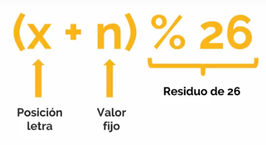
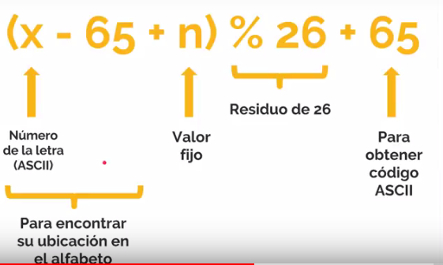

# CIFRADO CÉSAR

### Esto es la solución del cifrado cesar

Es un cifrado de sustitución en que cada letra se reemplaza en otro, esta nueva letra se tiene al operar por un numero fijo, por ejemplo si nuestro número fijo es 33 y nuestra letra es A y nos dezplasamos 33 espacios a la derecha de A nuestra nueva letra sería H.

**EJEMPLO**

* Texto Original : ABCDEFGHIJKLMNOPQRSTUVWXYZ

* Texto Codificado : HIJKLMNOPQRSTUVWXYZABCDEFG

**FÓRMULA**

> 

**FÓRMULA A UTILIZAR (ASCII)**
> 

**CONSIDERACIONES ESPECÍFICAS**

1. El programa debe ser capaz de cifrar y decifrar tanto letras mayúsculas como minúsculas. La fórmula para decifrar es: (x-n)%26.

2. El código esta compuesto por 2 funciones cipher y deciper

3. Aplicar la operación a los números de las posiciones pares

4. El usuario no debe ingresar un campo vacío o que contenga números.

**DIAGRAMA DE FLUJO**
[Una imagen cualquiera](Diagrama_de_flujo.PNG)